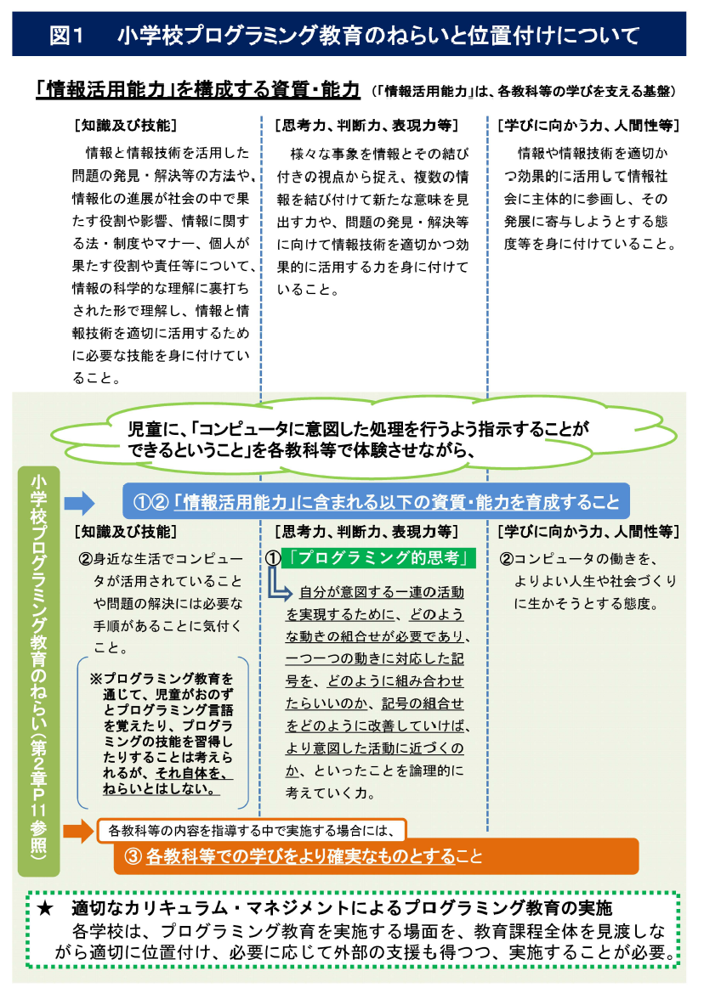
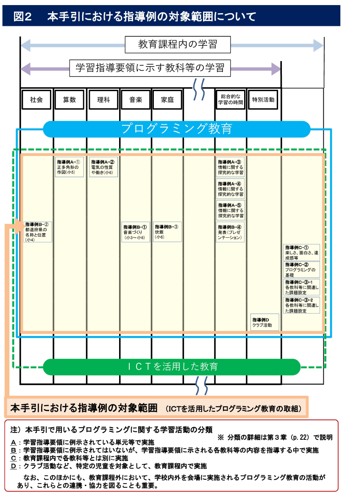

# はじめに ～ なぜ小学校にプログラミング教育を導入するのか ～

　今日、コンピュータは人々の生活の様々な場面で活用されています。家電や自動車をはじめ身近なものの多くにもコンピュータが内蔵され、人々の生活を便利で豊かなものにしています。誰にとっても、職業生活をはじめ、学校での学習や生涯学習、家庭生活や余暇生活など、あらゆる活動において、コンピュータなどの情報機器やサービスとそれによってもたらされる情報とを適切に選択・活用して問題を解決していくことが不可欠な社会が到来しつつあります。

　コンピュータをより適切、効果的に活用していくためには、その仕組みを知ることが重要です。コンピュータは人が命令を与えることによって動作します。端的に言えば、この命令が「プログラム」であり、命令を与えることが「プログラミング」です。プログラミングによって、コンピュータに自分が求める動作をさせることができるとともに、コンピュータの仕組みの一端をうかがい知ることができるので、コンピュータが「魔法の箱」ではなくなり、より主体的に活用することにつながります。

　プログラミング教育は子供たちの可能性を広げることにもつながります。プログラミングの能力を開花させ、創造力を発揮して、起業する若者や特許を取得する子供も現れています。子供が秘めている可能性を発掘し、将来の社会で活躍できるきっかけとなることも期待できるのです。

　このように、コンピュータを理解し上手に活用していく力を身に付けることは、あらゆる活動においてコンピュータ等を活用することが求められるこれからの社会を生きていく子供たちにとって、将来どのような職業に就くとしても、極めて重要なこととなっています。諸外国においても、初等教育の段階からプログラミング教育を導入する動きが見られます。

　こうしたことから、このたびの学習指導要領改訂において、小・中・高等学校を通じてプログラミング教育を充実することとし、2020 年度から小学校においてもプログラミング教育を導入することとなりました[^1]。

[^1]:「プログラミング教育」は、小・中・高等学校を通じて実施されますが、本手引では、
「小学校段階におけるプログラミング教育」の意味であることが文脈上明白であれば、単に「プログラミング教育」と表記している場合があります。

## 【本手引のねらい】

　教師の皆さんがプログラミング教育に対して抱いている不安を解消し、安心して取り組んでいただけるようにすることが本手引のねらいです。

　このため、本手引では、学習指導要領や同解説で示している小学校段階におけるプログラミング教育についての基本的な考え方などを、より具体的にかつ分かりやすく（できる限り専門用語を用いずに）解説しています。

　本手引を参照していただくことによって、プログラミング教育のねらいやどのような授業が期待されているのかをイメージしていただけるものと考えています。

### （プログラミング教育の位置付け）

　本手引はプログラミング教育を対象として解説していますが、プログラミング教育は、学習指導要領において「学習の基盤となる資質・能力」と位置付けられた「情報活用能力」の育成や情報手段（ICT）を「適切に活用した学習活動の充実」を進める中に適切に位置付けられる必要があります（図１（p.６）及び第２章（３）（p.16）を参照）。このことを前提に指導例（第３章）等を参照していただきたいと考えています。

### （プログラミング教育に関するカリキュラム・マネジメントと本手引で示す指導例の対象）

　学校の教育活動は、各学校の教育目標の下で、児童や学校、地域の実情等に応じて、各学校において創意工夫を生かした教育課程を編成して実施されるものであり、プログラミング教育も例外ではありません。本手引を参考として、学習指導要領に例示された教科・学年・単元等に限定することなく、適切なカリキュラム・マネジメントの下で、各学校の創意工夫を生かしたプログラミング教育が展開されることが期待されます。

　本手引においては、各学校における取組の参考となるよう、第３章において、学校の教育課程内におけるプログラミング教育のうち、ICT を用いて行う指導例（14 例）を紹介しています（図２（p.７）を参照）。まずはこれらを参考にプログラミング教育に取り組むことで、プログラミング教育のねらいを実感いただくとともに、徐々に他の授業での指導に取組を広げていただきたいと思います。

　さらに、教育課程外の学習活動においても、プログラミングに関する多様な学習機会が、児童の興味・関心等に応じて提供されることが望まれます。

　なお、本手引については、今後の教材の充実や各学校における実践の充実を踏まえて、また、官民が連携した「未来の学びコンソーシアム[^2]」の取組とも連携を図りながら、適時改訂を重ね、充実させていく予定です。平成 30 年３月の第一版の公表以降、本手引等を踏まえ、先行的にプログラミング教育の実践に取り組む学校や教育委員会も増えてきており、これらを通じて、手引における説明の充実や指導例の追加を行うことが望ましい点が明らかになったため、第二版を速やかに作成し、改訂を行いました（平成 30 年 11 月）。

　さらに、文部科学省では、本手引と併せて、事例集等の作成や、「未来の学びコンソーシアム」の運営する Web サイト「小学校を中心としたプログラミング教育ポータル」（https://miraino-manabi.jp/）を通じた本手引に掲載している指導例の具体的な実践事例の発信などの支援策も講じており、引き続き充実を図っていきますので、参照・活用ください。

　これらにより、各学校における指導の充実が図られるとともに、授業で使いやすいプログラミング教材が充実し、更にそれらを活用した優れた実践事例が蓄積され普及されることが期待されます。

[^2]: 文部科学省、総務省、経済産業省が連携して、教育・IT 関連の企業・団体等とともに設立（平成 29 年３月）したコンソーシアムであり、授業において活用可能なプログラミング教材の開発・普及、企業・団体等による人的支援の充実などに向けた取組を進めています。

## 【プログラミング教育の円滑な実施に向けて】

　2020 年度からの小学校プログラミング教育の実施に向けて、各学校や教育委員会等においては、前述の事例集や「未来の学びコンソーシアム」Web サイトなどを活用して、研修や教材研究等の準備を計画的に進めるとともに、学校の ICT 環境整備について、学校情報セキュリティの確保も含めて、しっかりと進めていくことが望まれます[^3]。

[^3]: 文部科学省においては、新学習指導要領の実施を見据え、「平成 30 年度以降の学校における ICT 環境の整備方針」を取りまとめるとともに、当該整備方針を踏まえ「教育のICT 化に向けた環境整備５か年計画（2018 ～ 2022 年度）」を策定しました。このために必要な経費については、2018 ～ 2022 年度まで単年度 1,805 億円の地方財政措置を講じることとされています。また、地方公共団体が、設置する学校を対象とする情報セキュリティポリシーの策定や見直しを行う際の参考となるよう、「教育情報セキュリティポリシーに関するガイドライン」を取りまとめ、公表しています。

　特に、教育委員会においては、各学校における取組を促し支援する体制を整え、2020 年度に向けた準備を、教育課程編成や学習指導等の側面と ICT 環境整備の側面との両面から計画的に進めることが必要であり、そのために必要な企業・団体や地域、教員養成系大学・学部等との連携にも積極的に取り組んでいただきたいと思います。

　各学校においては、まずは、教師一人一人が、本手引を参照してプログラミング教育のねらいを確認し、授業のイメージをつかんでいただきたいと思います。

　そして何より、教師が自らプログラミングを体験することが重要です。「プログラミングは難しそうだ」という印象がもたれがちですが、今日、教育用に開発されたビジュアル型プログラミング言語[^4]などの発展・普及により、児童も含めて多くの人々が容易に体験したり活用したりすることができるようになっています。

[^4]: プログラミング言語については、p.19 を参照してください。また、本手引において示しているプログラム例は、特定の言語によるプログラムではなく、ビジュアル型プログラミング言語を模した疑似的な言語によるものです。

　教師が自ら実際に体験することによって、プログラミングはそれほど難しいものではなく、むしろ面白いものだということが実感でき、さらに、授業でこんな使い方ができそうだというアイディアも湧いてくるものと思われます。

