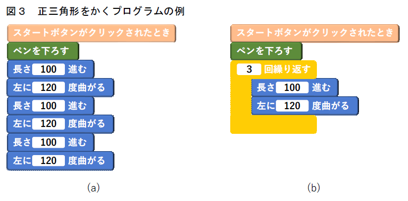
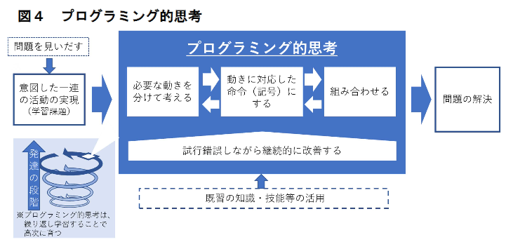

# 第２章 小学校プログラミング教育で育む力

## （１）プログラミング教育のねらい

　小学校におけるプログラミング教育のねらいは、「小学校学習指導要領解説 総則編」においても述べていますが、非常に大まかに言えば、①「プログラミング的思考」を育むこと、②プログラムの働きやよさ、情報社会がコンピュータ等の情報技術によって支えられていることなどに気付くことができるようにするとともに、コンピュータ等を上手に活用して身近な問題を解決したり、よりよい社会を築いたりしようとする態度を育むこと、③各教科等の内容を指導する中で実施する場合には、各教科等での学びをより確実なものとすることの三つと言うことができます。プログラミングに取り組むことを通じて、児童がおのずとプログラミング言語を覚えたり、プログラミングの技能を習得したりするといったことは考えられますが、それ自体をねらいとしているのではないということを、まずは押さえておいてください。

　①の「プログラミング的思考」及び②の「気付き」や「態度」については、この後の（２）で解説します。③の「各教科等での学びをより確実なものとする」とは、例えば、算数科において正多角形について学習する際に、プログラミングによって正多角形を作図する学習活動に取り組むことにより、正多角形の性質をより確実に理解することなどを指しています。

　また、これら①、②、③の三つのねらいの実現の前提として、児童がプログラミングに取り組んだり、コンピュータを活用したりすることの楽しさや面白さ、ものごとを成し遂げたという達成感を味わうことが重要です。「楽しい」だけで終わっては十分とは言えませんが、まず楽しさや面白さ、達成感を味わわせることによって、プログラムのよさ等への「気付き」を促し、コンピュータ等を「もっと活用したい」、「上手に活用したい」といった意欲を喚起することができます。さらに、学習活動に意欲的に取り組むことにより、「プログラミング的思考」を育むとともに、各教科等の内容を指導する中で実施する場合には、プログラミングを学習活動に取り入れることで、各教科等の学びも充実していくことが期待されます。このためには、学習指導要領に示すとおり、児童がプログラミングを「体験」し、自らが意図する動きを実現するために試行錯誤することが極めて重要となります。

　プログラミング教育の実施に当たっては、①、②をねらいとすること、各教科等の内容を指導する中でプログラミング体験を行う場合には、これに加えて③をねらいとすることが必要です。

　もちろん、学習場面ごとに必要なねらいのいずれかに重点を置くということは考えられますが、小学校６年間を通じて必要なねらいのいずれかが全く欠けていた、ということは望ましくありません。どのようにすれば「プログラミング的思考」を育み、「気付き」を促し「態度」を育むとともに各教科等の学びをより深めていくことができるのかについては、この後に述べていきます。

## （２）小学校プログラミング教育で育む資質・能力

　前章（p.９）で述べたように、有識者会議「議論の取りまとめ」では、プログラミング教育で育む資質・能力を、各教科等で育む資質・能力と同様に、資質・能力の「三つの柱」（「知識及び技能」、「思考力、判断力、表現力等」、「学びに向かう力、人間性等」）に沿って整理しています。これらについて、小学校の児童の発達の段階を踏まえると、次のように考えることができます。

### ①　知識及び技能

　子供たちがコンピュータを用いて情報を活用したり発信したりする機会が一層増えてきている一方で、その仕組みがいわゆる「ブラックボックス化」しています。有識者会議「議論の取りまとめ」（参考２（p.52））の「子供たちに、コンピュータに意図した処理を行うよう指示することができるということを体験させながら」とは、そうした情報社会に生きる子供たちが、コンピュータに意図した処理を行うよう指示をする活動を通して、コンピュータはプログラムで動いていること、プログラムは人が作成していること、また、コンピュータには得意なこととなかなかできないこととがあることを、体験を通して気付かせることです。コンピュータが日常生活の様々な場面で使われており、生活を便利にしていることや、コンピュータに意図した処理を行わせるためには必要な手順があることに気付くことが、今後の生活においてコンピュータ等を活用していく上で必要な基盤となっていきます。

　プログラムを作成する上でのアルゴリズム（問題を解決する手順を表したもの）の考え方やその表現の仕方、コンピュータやネットワークの仕組み、コンピュータを用いた問題の発見・解決のための知識及び技能等については、中学校や高等学校の各教科等で学習しますので、小学校段階では、こうしたことへの「気付き」が重要と考えられます。なお、有識者会議「議論の取りまとめ」では、プログラミング教育で育む知識及び技能について、小・中・高の学校段階に応じて、次のように示されています。

> **参考 有識者会議「議論の取りまとめ」（抜粋）**
（小）身近な生活でコンピュータが活用されていることや、問題の解決には必要な手順があることに気付くこと。
（中）社会におけるコンピュータの役割や影響を理解するとともに、簡単なプログラムを作成できるようにすること。
（高）コンピュータの働きを科学的に理解するとともに、実際の問題解決にコンピュータを活用できるようにすること

### ②　思考力、判断力、表現力等

　有識者会議「議論の取りまとめ」（参考２（p.52））では、プログラミング教育で育む思考力、判断力、表現力等について、「発達の段階に即して、「プログラミング的思考」を育成すること。」としています。コンピュータに意図した処理を行わせるために必要な論理的思考力、すなわち「プログラミング的思考」を育成することは、小学校におけるプログラミング教育の中核とも言えますので、以下に詳しく解説します。

#### 【「プログラミング的思考」とは】

　有識者会議「議論の取りまとめ」において「プログラミング的思考」は、「自分が意図する一連の活動を実現するために、どのような動きの組合せが必要であり、一つ一つの動きに対応した記号を、どのように組み合わせたらいいのか、記号の組合せをどのように改善していけば、より意図した活動に近づくのか、といったことを論理的に考えていく力」と説明されています。

　このことをコンピュータを動作させることに即して考えます。コンピュータに自分が考える動作をさせるためには、①コンピュータにどのような動きをさせたいのかという自らの意図を明確にした上で、まず、②コンピュータにどのような動きをどのような順序でさせればよいのかを考えます。この際、意図した一連の動きが、一つ一つの動きをつなげたものであることを理解する必要があります。そして、③一つ一つの動きに対応する命令（記号）が必要であることを理解し、コンピュータが理解できる命令（記号）に置き換えた上で、④これらの命令（記号）をどのように組み合わせれば自分が考える動作を実現できるかを考えます。[^5]さらに、⑤その命令（記号）の組合せをどのように改善すれば自分が考える動作により近づいていくのかということも試行錯誤しながら考えていきます。

[^5}: コンピュータを動作させるために命令（記号）の組合せを考える際には、たとえば、命令（記号）を順序立てたり、条件を設定して命令（記号）を分岐させたり、命令（記号）を繰り返させたりすることなどが考えられます。これらは一般的にプログラミングを支える基本的な要素とされています。

| **コンピュータを動作させるための手順（例）** |
|:--------------------------------------------------------:|
| ① コンピュータにどのような動きをさせたいのかという自らの意図を明確にする ↓  ② コンピュータにどのような動きをどのような順序でさせればよいのかを考える ↓  ③ 一つ一つの動きを対応する命令（記号）に置き換える ↓  ④ これらの命令（記号）をどのように組み合わせれば自分が考える動作を実現できるかを考える ↓  ⑤ その命令（記号）の組合せをどのように改善すれば自分が考える動作により近づいていくのかを試行錯誤しながら考える|

#### （「正多角形をかく」場合について考える）

　具体的には、例えば、コンピュータで正三角形をかこうとする場合を見てみます。「正三角形をかく」という命令は通常は用意されていませんので、そのままでは実行できません。そこで、コンピュータが理解できる（用意されている）命令を組み合わせ、それをコンピュータに命令することを考えます。

　紙の上に作図する場合、正多角形がもっている「辺の長さが全て等しい」、「角の大きさが全て等しい」、「円に内接する」、「中心角の大きさが全て等しい」のような正多角形の意味や性質などを使って作図します。

　コンピュータで作図する場合にも同じことを考えます。算数科の授業では円と組み合わせて作図しますが、ここでは、「辺の長さが全て等しく、角の大きさが全て等しい」という正多角形の意味を使って作図する場合を考えてみます。この場合、「長さ 100 進む（線を引く）」、「左に 120 度曲がる」といったコンピュータが理解できる（用意されている）命令を組み合わせることで「正三角形をかく」ことができます。さらに、もっと大きな正三角形をかきたければ、「長さ 100 進む（線を引く）」を、例えば「長さ 200 進む（線を引く）」というように修正します。曲がる角度を変えることで、正六角形や正八角形もかくことができます。また、図３(a)のように「長さ 100 進む（線を引く）」、「左に 120 度曲がる」を３回記述するという方法のほか、(b)のようにこれらを「３回繰り返す」と記述する方法もあります。結果は同じですが、正六角形や正八角形をかくときを考えると後者の方が効率的です。紙の上に鉛筆と定規、分度器やコンパス等を用いて正三角形をかくときも、用いる性質や手順そのものは異なるとしても、児童は同じように手順を考えた上で作図しているはずです。

　「プログラミング的思考」は、これらのことを「論理的に考えていく力」です（図４）。前述の例「正多角形をかく」の場合、数学的な見方・考え方を働かせながら、「正三角形をかく」という意図した一連の活動（学習課題） に対して、図形に関する既習事項を活用して、正三角形をかくのに「必要な動きを分けて考える」、「動きに対応した命令にする」、「それらを組み合わせる」、「必要に応じて継続的に改善する」といった試行錯誤を行う中でプログラミング的思考を働かせています。

　このように、児童は試行錯誤を繰り返しながら自分が考える動作の実現を目指しますが、思い付きや当てずっぽうで命令の組合せを変えるのではなく、うまくいかなかった場合には、どこが間違っていたのかを考え、修正や改善を行い、その結果を確かめるなど、論理的に考えさせることが大切です。

#### （「プログラミング的思考」を育成する）

　ここで、思考力、判断力、表現力等は、短時間の授業で身に付けさせたり急激に伸ばしたりできるものではないことに留意する必要があります。「プログラミング的思考」は、プログラミングの取組のみで育まれたり、働いたりするものではありません。思考力、判断力、表現力等を育む中に、「プログラミング的思考」の育成につながるプログラミングの体験を計画的に取り入れ、位置付けていくことが必要となります。

### ③　学びに向かう力、人間性等

　有識者会議「議論の取りまとめ」（参考２（p.52））の「発達の段階に即して、コンピュータの働きを、よりよい人生や社会づくりに生かそうとする態度を涵養すること。」とは、児童にとって身近な問題の発見・解決に、コンピュータの働きを生かそうとしたり、コンピュータ等を上手に活用してよりよい社会を築いていこうとしたりする、主体的に取り組む態度を涵養することを示しています。また、他者と協働しながらねばり強くやり抜く態度の育成、著作権等の自他の権利を尊重したり、情報セキュリティの確保に留意したりするといった、情報モラルの育成なども重要です。

## （３）プログラミング的思考と情報活用能力

　「プログラミング的思考」の育成を考える際、「情報活用能力」との関係を確認しておくことが重要です。新しい学習指導要領において、情報活用能力は、「学習の基盤となる資質・能力」と位置付けられ、「教科等横断的な視点から教育課程の編成を図」り育成することとしています。そして、学習指導要領解説総則編においては、「情報活用能力」は、学習活動において必要に応じてコンピュータ等の情報手段を適切に用いて、情報を得たり、整理・比較したり、発信・伝達したり、保存・共有したりといったことができる力であり、さらに、このような学習活動に必要な情報手段の基本的な操作技能や、プログラミング的思考、情報モラル、情報セキュリティ等に関する資質・能力も含むものとしています。

　こうした情報活用能力を育むためには、単にプログラミング教育を充実し「プログラミング的思考」を育めばよいということではなく、情報を収集・整理・比較・発信・伝達する等の力をはじめ、情報モラルや情報手段の基本的な操作技能なども含めたトータルな情報活用能力を育成する中に、「プログラミング的思考」の育成を適切に組み入れていく必要があります。

　さらに、小学校段階では、コンピュータに関する専門的な知識等は求められませんが、プログラムの働きやよさへの気付きや、論理的に考えていく力である「プログラミング的思考」、コンピュータ等をよりよく活用していこうとする態度等は、その後の中学校や高等学校での学びに、とりわけ情報についての科学的な理解に基づいた情報活用能力の育成につながっていくものです。このように、「プログラミング的思考」を含む情報活用能力を、児童生徒の発達の段階に応じて捉えていくことも重要です。

　プログラミング教育により育む力をより詳細に整理する試みは、既に文部科学省の調査研究事業や学会等においても始められています[^6]。今後、各学校での実践を踏まえて研究が更に深められ、一層充実していくことが期待されます。

[^6]: 文部科学省の「情報教育推進校事業」（IE-School）や日本 STEM 教育学会などにおいて、プログラミング教育で育む資質・能力を含めた情報活用能力を、資質・能力の三つの柱 に沿って、児童生徒の発達の段階に応じて整理する試みが行われています。

## （４）プログラミング教育のねらいの実現に向けて

　（１）で述べたように、プログラミング教育の実施に当たっては、プログラミングの体験を通して、①「プログラミング的思考」を育むことと、②プログラムの働きやよさ等への「気付き」を促し、コンピュータ等を上手に活用して問題を解決しようとする態度を育むこと、③各教科等の内容を指導する中で実施する場合には、各教科等の学びをより確実なものとすることをねらいとしていることを踏まえて取り組むことが重要です。

### （カリキュラム・マネジメントの重要性）

　プログラミング教育のねらいを実現するためには、各学校において、プログラミングによってどのような力を育てたいのかを明らかにし、必要な指導内容を教科等横断的に配列して、計画的、組織的に取り組むこと、さらに、その実施状況を評価し改善を図り、育てたい力や指導内容の配列などを見直していくこと（カリキュラム・マネジメントを通じて取り組むこと）が重要です。

| **プログラミング教育のねらいを実現するための手順（例）** |
|:--------------------------------------------------------:|
| プログラミングによって育てたい力を明らかにする   ↓  必要な指導内容を教科等横断的に配列する   ↓   計画的、組織的に取り組む   ↓   育てたい力や指導内容の配列などを見直す |

### （カリキュラム・マネジメントの取組例）

　既に複数の自治体において、「プログラミング的思考」を含めた情報活用能力を育成するためのカリキュラム・マネジメントに取り組んでいる例が見られます。

　例えば、Ａ市教育委員会においては、情報の収集・判断・処理・編集・創造・表現や情報モラルなど、情報活用能力の育成を意図したカリキュラムの中にプログラミング教育を位置付けています。ここで情報活用能力を育成するいわば「核」となる時間として設定されている授業時数は各学年とも数単位時間程度であり、各学校において、この時間のほかにも教科・学年・単元等の特質に応じて情報活用能力を育むとともに、学習過程の中に ICT 活用を適切に位置付けることとされています。プログラミングについて市教育委員会として示されているのは、学習指導要領に例示されている単元のほか、それに先立ってプログラミングを体験する時間を設けること程度であり、各学校においてそれぞれの実情を踏まえ、プログラミングに関する内容を追加することとされています。

　また、Ｂ市教育委員会においては、プログラミング教育によって育てたい資質・能力を、資質・能力の三つの柱に沿って、低・中・高学年の発達の段階に応じて、明らかにしています。その際、学習活動の前提となるコンピュータ等の操作技能の習得も考慮されています。なお、一部の学習活動については、学校の裁量に委ね、各学校・教師の創意工夫が促されています。各学年とも年間で３つの単元等でプログラミング教育に取り組むこととされており、無理なく取り組めるものとなっています。

　いずれの例も、複数の教科・学年を見通して情報活用能力を育成することをねらいとし、既存の単元等の学習活動を見直して整理されたものであり、教育委員会において域内の学校での取組について一定の方向性を示したものです。

　こうした先進事例も参考としつつ、各学校の実情等を踏まえながら、同様のカリキュラム・マネジメントに組織的に取り組むこと、教育委員会がそうした取組を支援しあるいはリードしていくことが求められます。

　プログラミング教育によって児童にどのような力を育むのかを考え、そのための場面や授業を設計し、そして目指す力を児童に育むことができたのかを見取る、といったことは教育の専門家である教師だからこそできることです。その上で、企業・団体や地域等の専門家と連携し協力を得る（外部の人的・物的資源を活用する）ことは極めて有効です。教師が学校外の専門家と積極的に連携・協力してプログラミング教育を実施していくことは、「社会に開かれた教育課程[^7]」の考え方にも沿ったものであり、積極的な取組が期待されます。こうした企業・団体や地域等との連携の具体例等については第４章（p.42）で紹介します。

[^7]: よりよい学校教育を通じてよりよい社会を創るという目標を共有し、社会と連携・協働しながら、子供たちに未来の創り手となるために必要な資質・能力を育んでいくという考え方。

　企業・団体や地域等の専門家と連携し協力を得る（外部の人的・物的資源を活用する）ことは、カリキュラム・マネジメントの一環としても重要なことです。プログラミング教育を充実していくためには、学校外の人的・物的資源の活用について、学校全体で組織的に取り組むのはもちろんのこと、教育委員会が様々なかたちで各学校を支援し、リードしていくことも重要です。

　このほかにも、カリキュラム・マネジメントを通じてプログラミング教育を進めていくに当たっては、以下に述べるように何点か留意すべき点があります。

#### ア　コンピュータを用いずに行う指導の考え方

　コンピュータを用いずに行う「プログラミング的思考」を育成する指導については、これまでに実践されてきた学習活動の中にも、例えば低学年の児童を対象にした活動などで見いだすことができます。ただし、学習指導要領では児童がプログラミングを体験することを求めており、プログラミング教育全体において児童がコンピュータをほとんど用いないということは望ましくないことに留意する必要があります。コンピュータを用いずに「プログラミング的思考」を育成する指導を行う場合には、児童の発達の段階を考慮しながらカリキュラム・マネジメントを行うことで児童がコンピュータを活用しながら行う学習と適切に関連させて実施するなどの工夫が望まれます。

#### イ　プログラミング言語や教材選定の観点

　プログラミング言語[^8] については、あたかもブロックを組み上げるかのように命令を組み合わせることなどにより簡単にプログラミングできる言語（ビジュアル型プログラミング言語）が普及しており、種類も豊富です。マウスやタッチ操作が主で（表示させる言葉や数などはキーボードで入力します。）、ブロックの色で機能の分類を示すなど視覚的に把握しやすく、また、その言語の細かな文法を気にすることなくプログラムを作成することができますので、自分が考える動きを実現することに専念することができます。多くの場合、児童は短時間で基本的な使い方を覚え、簡単なプログラムであれば作成できるようになります。この後の指導例においても、ビジュアル型プログラミング言語を用いて学習が展開されることを想定しています。

[^8]: プログラミング言語を用いてプログラムを記述・修正したり実行したりするためのソフトウェア（ツール群）を「開発環境」と呼びますが、ここでは、プログラミング言語と開発環境とを厳密に区別せずに、「プログラミング言語」としています。

　また、文字により記述する言語（テキスト型プログラミング言語）にも様々なものがあります。キーボード操作が多く、それぞれの言語の文法の理解も必要となりますが、英数字だけでなく日本語で記述できるものや、文法的な誤りがあった場合には間違いを指摘してくれるものなど、児童でも比較的取り組みやすい言語もあります。ある程度の授業時数を確保して取り組む場合や、プログラミングに強い興味・関心を示す児童については、こうした言語を活用することも考えられます。
　
　プログラミングに関する教材についても多様なものがあります。特定の単元等や学習内容に対応した教材の中にも、教科の内容をより確実に学習するためのツールとして用いることを想定しプログラミング自体はできる限り平易に行えるようにしたものから、プログラミング的思考の育成を強くねらったものまであります。また、プログラミングの考え方や技能、特定のプログラミング言語の習得を目的とした教材もあります。

　これらの複数の言語や教材の中から、それぞれの授業においてプログラミングを取り入れるねらい、学習内容や学習活動、児童の発達の段階等に応じて、適切なものを選択し活用することが望まれます。児童の発達の段階や学習経験を踏まえて、児童の負担にならない範囲で、学習内容等に応じて使用する言語を変更することも考えられます。

　また、プログラミング言語は、情報技術の進展の中で変化し続けていますし、新たな教材も次々と生み出されてきています。より授業で使いやすい言語や教材を追求していくことも重要です。

## （５）プログラミング教育の評価

　プログラミング教育を各教科等の内容を指導する中で実施する場合には、「プログラミング的思考」等を育むとともに、それぞれの教科等の学習をより深いものとすることが重要です。プログラミングを実施した際の評価については、あくまでも、プログラミングを学習活動として実施した教科等において、それぞれの教科等の評価規準により評価するのが基本となります。すなわち、プログラミングを実施したからといって、それだけを取り立てて評価したり、評定をしたりする（成績をつける）ものではありません。

　その上で、（２）で述べたプログラミング教育で育む資質・能力なども参考とし、各学校がプログラミング教育で育みたい力を明らかにし、各教科等において「プログラミング的思考」等を育むための学習活動を計画し実施して、児童の資質・能力の伸びを捉えるとともに、特に意欲的に取り組んでいたり、プログラムを工夫していたりなど、目覚ましい成長のみられる児童には、機会を捉えてその評価を適切に伝えること等により、児童の学びがより深まるようにしていくことが望ましいと考えられます。

　また、教育課程内で各教科等とは別に実施する場合は、教科等の評価規準により評価したり、評定をしたりすることはありませんが、それ以外は前述と同様に児童を見取り、その評価を適切に伝えるなどすることが望ましいと考えられます。
