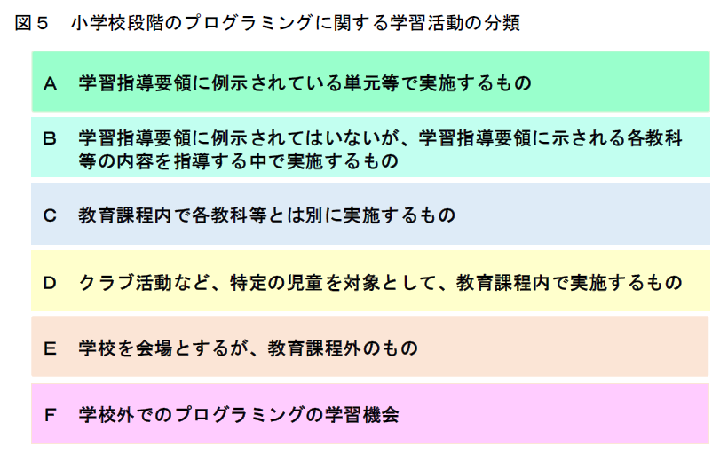
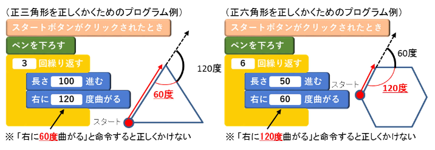
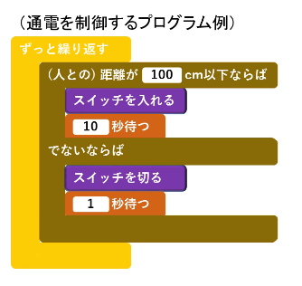

# 第３章 各教科等の目標・内容を踏まえた指導の考え方

　以下に、各教科等の目標・内容を踏まえたプログラミングに関する学習活動の例（以下、「指導例」とします。）を解説します。

　指導例を参考として、「プログラミング的思考」の育成、プログラミングのよさ等への気付きやコンピュータ等を上手に活用しようとする態度の育成、それぞれの教科等の目標の実現を目指した指導に取り組むことが望まれます。

　プログラミング教育は、学習指導要領に例示した単元等に限定することなく、多様な教科・学年・単元等において取り入れることが可能です。以下に示す指導例を参考として、各学校において工夫して多様な教科・学年・単元等に適切に取り入れていくことが望まれます。

　さらに、プログラミング教育は学校内外の様々な場面でも実施することが考えられます。図５にプログラミングに関する学習活動の分類の一例を示しました。これは、現在までに見られた例を基に分類を試みたものであり、本手引では、教育課程内で実施されるＡ～Ｄの指導例を示します。

　指導例を通じて、プログラミング教育の導入は、従来の指導方法を否定するものではなく、従来、教師が取り組んできた指導をよりやりやすくしたり、より豊かにしたりすることにも貢献するものだということを理解いただきたいと思います。

　Ａ及びＢは、学習指導要領に例示されているか、いないかの違いはありますが、どちらも、各教科等での学びをより確実なものとするための学習活動としてプログラミングに取り組むものです。

　これに対し、Ｃは、学校の裁量により、学習指導要領に示されている各教科等とは別にプログラミングに関する学習を行うものです。この場合、児童の負担過重とならない範囲で実施することが前提であることに留意する必要があります。また、プログラミングに関する知識や技能を一定程度体系的に学ぶことも考えられますが、児童がプログラミングに取り組みやすくなるよう、必要に応じて各教科等の内容と関連させるなど、各学校の創意工夫を生かした取組が期待されます。

　Ｄは、教育課程内で、クラブ活動など特定の児童を対象として実施されるものです。

　Ｅ及びＦは、学校の教育課程に位置付くものではありませんが、地域や企業・団体等においてこれらの学習機会が豊富に用意され、児童の興味・関心等に応じて提供されることが期待されるところであり、学校においても、児童の興味・関心等を踏まえ、こうした学習機会について適切に紹介するなど、相互の連携・協力を強化することが望まれます。

## Ａ 学習指導要領に例示されている単元等で実施するもの

### Ａ－①　プログラミングを通して、正多角形の意味を基に正多角形をかく場面（算数 第５学年）

> 図形を構成する要素に着目し、プログラミングを通した正多角形のかき方を発展的に考察したり、図形の性質を見いだしたりして、その性質を筋道を立てて考え説明したりする力を確実に育みます。

　ここでは、正多角形について、「辺の長さが全て等しく、角の大きさが全て等しい」という正多角形の意味を用いて作図できることを、プログラミングを通して確認するとともに、人にとっては難しくともコンピュータであれば容易にできることがあることに気付かせます。

#### （学習の位置付け）

　この学習は、正多角形の単元において、正多角形の基本的な性質や、円と関連させて正多角形を作図することができることを学習した後に展開することが想定されます。

#### （学習活動とねらい）

　学習活動としては、例えば、「辺の長さが全て等しく、角の大きさが全て等しい」という正多角形の意味を用いて正多角形を作図するといった課題を設定し、定規と分度器を用いた作図とプログラミングによる作図の双方を試みるといったことが考えられます。

　はじめに、正六角形などを定規と分度器を用いて作図することを試みさせ、手書きではわずかな長さや角度のずれが生じて、正確に作図することは難しいことを実感させます。

　次いで、プログラミングによる正方形の作図の仕方を学級全体で考え、個別又は少人数で実際にプログラミングをして正方形が正確に作図できることを確認した上で、プログラミングによる正三角形や正六角形などの作図に取り組みます。

　児童は、手書きで正方形を作図する際の「長さ□ cm の線を引く」、「（線の端から）角度が 90 度の向きを見付ける」といった動きに、どの命令が対応し、それらをどのような順序で組み合わせればよいのかを考え（プログラミング的思考）、また、繰り返しの命令を用いるとプログラムが簡潔に書けることに気付いていきます。

　そして、「正三角形をかこうとして 60 度（正六角形をかこうとして 120 度） 曲がると命令すると正しくかくことができないのはなぜか」、「なぜ正三角形のときは 120 度で、正六角形のときは 60 度でかけるのか」といった疑問をもち、他の児童と話し合い試行錯誤することによって、図形の構成要素に着目して、正多角形の角の大きさと曲がる角度との関係を見いだしていきます。また、正三角形や正六角形だけでなく、正八角形や正十二角形など、辺の数が多い正多角形も繰り返しの回数や長さ、角度を通して考えてかいていきます。

　さらに、「辺の長さが全て等しく、角の大きさが全て等しい」という正多角形の意味を用いて考察することにより、今までかいたこともない正多角形をかくことができることとともに、人が手作業でするのは難しかったり手間がかかりすぎたりすることでも、コンピュータであれば容易にできることもあるのだということに気付くことができます。

### Ａ－②　身の回りには電気の性質や働きを利用した道具があること等をプログラミングを通して学習する場面（理科 第６学年）

> プログラミングを通して、身の回りには電気の性質や働きを利用した道具があることに気付くとともに、電気の量と働きとの関係、発電や蓄電、電気の変換について、より妥当な考えをつくりだし、表現することができるようにします

　ここでは、身近にある、電気の性質や働きを利用した道具について、その働きを目的に合わせて制御したり、電気を効率よく利用したりするする工夫がなされていることを、プログラミングを通して確認します。

#### （学習の位置付け）

　この学習は、電気の利用の単元において、電気はつくりだしたり蓄えたりすることができること、光、音、熱、運動などに変換できること等について学習した後に、身の回りにはそうした電気の性質や働きを利用した道具があることについての学習に位置付けて展開することが想定されます。

#### （学習活動とねらい）

　学習活動としては、例えば、日中に光電池でコンデンサに蓄えた電気を夜間の照明に活用する際に、どのような条件で点灯させれば電気を効率よく使えるかといった問題について、児童の考えを検証するための装置と通電を制御するプログラムとを作成し実験するといったことが考えられます。具体的な実験装置としては、手回し発電機や光電池などでコンデンサに蓄えた電気を電源とし、物体との距離を計測するセンサーにより通電を制御するスイッチをつないだ、発光ダイオードの点灯回路を作成し、その上で、このスイッチの通電を制御するプログラムの作成に取り組みます。なお、児童が取り組みやすくなるよう、実際の道具よりも単純化したモデルとすることが大切です。

　児童は、人が必要とする明るさは確保しつつ、照明が点灯したままにしないなど電気を無駄なく効率よく使うためには、センサーが人を感知する距離や時間などの条件をどのように設定すればよいかなどの疑問をもち、センサーを用いた通電の制御（自分が意図する動き）はどのような手順で動作するのか、それを再現するには命令（記号）をどのように組み合わせればよいのかを考え、試行錯誤しながら（プログラミング的思考）プログラムを作成します。さらに、こうした体験を通して、人を感知するセンサーで制御された照明などが住宅や公共施設などの身近なところで活用されていることや、電気を効率的に利用したり快適に利用したりできるようプログラムが工夫されていることに気付くことができます。

### Ａ－③　「情報」を探究課題に設定した学習場面（総合的な学習の時間）

> 情報技術が私たちの生活を便利にしていることをプログラミングを通して確認するとともに、この体験をよりどころとして、情報に関する探究を進めていきます。

　ここでは、情報技術が私たちの生活や社会に果たしている役割と与えている影響について調べ、また、どのように情報技術を活用していけばよいかを考えるなど、情報に関する課題の探究を進める中で、情報技術が私たちの生活を便利にしていることをプログラミングを通して確認します。

#### （学習の位置付け）

　この学習は、プログラミングの体験をよりどころとして、児童が情報に関する課題を見いだし、探究していくことができるよう、「情報」に関する探究の早い段階に位置付けることが想定されます。

#### （学習活動とねらい）

　学習活動としては、例えば、身の回りの様々な製品やシステムが、プログラムで制御されており、それらが、機械的な仕組みとは違った利点があることを、ジュースの自動販売機のプログラムの作成を通して体験的に理解する、といったことが考えられます。

　具体的には、まずカプセルトイの自動販売機とジュースの自動販売機の仕組みを比較して、コンピュータにより機械を制御することで、硬貨の種類を判別したり、残りの商品の有無や温度を管理したりなど、様々な判断を自動で行っていることに気付かせます。次いで、硬貨が投入されるとボタンが押せるようになり、ボタンを押すことでジュースの缶を排出する、といった自動販売機の動きの一部（投入された硬貨の合計額を求める、投入された金額で買える商品だけボタンを押せるようにする、ボタンが押された商品を排出するなど）を再現するプログラムを作成します。

　児童は、生活の中での経験を基に、自動販売機はどのような手順で動作しているのか、それを再現するには命令（記号）をどのように組み合わせればよいかを考え、試行錯誤します（プログラミング的思考）。こうした体験を通して、プログラムの働きを理解するとともに、機械的な仕組みでは難しいことでもコンピュータでは容易であることを実感します。

　さらに、この体験を基に自らの生活を振り返り、電気・水道・公共交通機関などのライフラインを維持管理するためにもプログラムが働いていることや、AI(人工知能)やビッグデータの活用、ロボットの活用によって、私たちの生活がより快適になり効率的になっていることにも気付きます。

　また、コンピュータを利用したウイルスやネット詐欺などのプログラムの悪用にも触れることで、こうした情報技術をどのように活用していけば、私たちの生活がもっと便利になり、危険なく生活できるようになるのかなどを探究する課題として設定することも考えられます。そうした探究活動を通して、「人間らしさとは何か」、「人間にしかできないこととは何か」、「人間としてどのように暮らしていけばいいのだろうか」など、自分の生き方を考え直すことも期待されます。

#### （その他考えられる学習活動の工夫）

　なお、ジュースの自動販売機をコンピュータの画面上で疑似的に再現するだけでなく、センサーを用いてスイッチを押されたことを検知したり、モーターを用いて商品を排出したりするなど、自動販売機のモデルを製作することなども考えられます。

## Ｂ　学習指導要領に例示されてはいないが、学習指導要領に示される各教科等の内容を指導する中で実施するもの

### Ｂ－①　様々なリズム・パターンを組み合わせて音楽をつくることをプログラミングを通して学習する場面（音楽	第３学年～第６学年）

> 様々なリズム・パターンの組み合わせ方について、このようにつくりたいという思いや意図をもち、様々なリズム・パターンの面白さに気付きながら、プログラミングによって試行錯誤をすることを通して、まとまりのある音楽をつくります。

　ここでは、様々なリズム・パターンを組み合わせた、まとまりのある音楽づくりを、プログラミングによって行います。

#### （学習の位置付け）
　音楽づくりの題材において、プログラミングによってまとまりのある音楽をつくった後、つくった音楽を実際に自分たちで表現し、それぞれの表現のよさを認め合う学習が想定されます。

#### （学習活動とねらい）

　様々なリズム・パターンを組み合わせて、まとまりのある音楽をつくるという課題を設定し、プログラミング言語又は創作用ソフト等を用いて音楽づくりをすることが考えられます。

　児童は、教師があらかじめ用意しておいた、例えば、「ドンドン」、「ドンドコ」、「ドドンコ」といったリズム・パターンを実際に表現し、即興的に選択したり組み合わせたりする活動を楽しんだ後に、まとまりを意識した音楽をつくることに取り組みます。その際、このような音楽を、このようにしてつくりたいという自分の考えをもち、音楽の仕組みを意識しながら、プログラミング言語又は創作用ソフト等を用いて様々なリズム・パターンの組み合わせ方を試し、更に工夫を重ねて試行錯誤し（プログラミング的思考）、音楽をつくっていきます。

　この過程において、つくった音楽の構造を視角的に捉え、つくった音楽を再生しモニタリングしながら、リズム・パターンの組合せの面白さに気付くとともに、音楽の仕組みを用いてつくる技能を身に付け、音楽表現を高めていきます。器楽の技能や読譜などの力に大きく左右されずに活動できるため、無理なく音楽づくりの学習に取り組むことが期待されます。

　その後、つくった音楽を実際に演奏して互いに聴き合い、それぞれの表現のよさを認め合う学習を展開することも大切です。

#### （その他考えられる学習活動の工夫）

　これはリズム・パターンを組み合わせて音楽をつくる活動ですが、音の長さや高さ、強弱、速度などをプログラミングしながら、表情豊かな旋律をつくる活動をすることも考えられます。

### Ｂ－②　課題について探究して分かったことなどを発表（プレゼンテーション）する学習場面（総合的な学習の時間）

　ここでは、課題について探究して分かったことや考えたことなどを、プログラミングによって、より分かりやすく効果的に発表（プレゼンテーション）する資料を作成します。

#### （学習の位置付け）

　この学習は、様々な課題を設定して行われる探究活動のまとめの段階に位置付けて実施することが考えられます。

#### （学習活動とねらい）

　学習活動としては、例えば、「街づくり」を課題に設定して探究活動を行い、分かったことや考えたことなどを発表するための資料を作成する際、地図上のある地点にマウスポインタを移動させると、その場所の魅力や、その場所に寄せる地域の人々の思い、その場所に関わる街づくりの課題や取組などを、文字、音声、アニメーションなどで紹介するようプログラミングすることなどが想定されます。

　児童は、どのような内容を紹介するかだけでなく、どのような方法で紹介するか、更に「発表をスムーズに行うために、マウスではなくキーボードで操作するにはどうすればよいか」といったことを考え、試行錯誤しながら発表資料を作成します。その過程で、自分の意図する資料を作成したり発表したりするための手順（組合せ）などを考えていきます（プログラミング的思考）。

　なお、こうした学習活動は、総合的な学習時間のみならず、他の教科等でも取り入れることが考えられます。

## Ｃ　各学校の裁量により実施するもの（Ａ、Ｂ及びＤ以外で、教育課程内で実施するもの）

　プログラミングの体験は、各教科等において学習指導要領に示される内容と関連付けて実施するほか、学校の裁量で、何らかの教科等に位置付けることなく、かつ教育課程内で、実施することも考えられます。これらの場合には、例えば、汎用性の高いプログラミング言語を用いて、児童が表現したいものを表現したり、見いだした課題を解決するためのプログラムを作成したりすることなどを通して、プログラミング的思考を育むとともに、プログラミングに関する一定の体系的な知識や技能を学ぶことも考えられます。

　こうしたプログラミングの体験は、各教科等と特に関連をもたせることなく実施することもできますが、各教科等の学習と関連させた具体的な課題を設定して実施することで児童が取り組みやすくすることも考えられます。

### Ｃ－①　各教科等の学習を基に課題を設定し、プログラミングを通して課題の解決に取り組む学習を展開する例

　例えば、学校の裁量で時間を確保し、社会科の我が国の工業生産（第５学年）における優れた製品を生産するための様々な工夫や努力の学習と関連付けて、自動追突防止装置のついた自動車のモデルの製作と追突を回避するためのプログラムの作成を行うことなどが考えられます。

　具体的には、距離を計測するセンサーと車輪を駆動するモーターを組み込んだ、自動車の簡単なモデルを製作し、それを制御するプログラムを作成します。地域の産業の特色に応じて、自動車以外の工業生産を取り上げたり、農業生産や運輸などの学習と関連付けて同様の活動を展開したりすることも考えられます。

　こうしたプログラミングの体験を通して児童が実感を伴って学ぶことで、工業生産などに関わる技術の開発や研究などの理解につながることが期待されます。

### Ｃ－②　各教科等の学習を基に、プログラミングを通して表現したいものを表現する学習を展開する例

　例えば、国語科において物語を読む学習をした後、学校の裁量で時間を確保し、物語の中から好きな場面を選び、その場面のアニメーションを作成することなどが考えられます。

　具体的には、登場人物と背景の絵をかきその絵をカメラやスキャナで取り込むなどして、プログラミングにより登場人物が動いたり、話したりするようにします。そして、互いの作品を見せ合い、その場面での登場人物の気持ちや情景はどのようであると考えたのか、登場人物の気持ちや情景を表現するためにどのような工夫をしたのかなどについて話し合ったりすることなどが考えられます。

### Ｃ－③　プログラミング言語やプログラミングの技能の基礎についての学習を実施する例

　例えば、各教科等におけるプログラミングに関する学習活動の実施に先立って、学校の裁量で時間を確保し、プログラミング言語やプログラミングに関する基礎的な知識や技能の習得などを目的として、プログラミングを体験することも考えられます。

　後に実施する単元等で使用する予定であるプログラミング言語やソフトウェアの操作を、１～数単位時間程度でもあらかじめ経験しておくことにより、各教科等におけるプログラミングに関する学習活動に、児童は戸惑うことなく取り組むことができ、授業が円滑に進められることが期待されます。

　こうしたプログラミングの体験そのものは直ちに各教科等の学習として位置付くものではありませんが、キーボードによる文字入力やファイル操作等の情報機器の基本的な操作技能と同様に、後の学習活動を円滑に進めるための学習活動として、学校の判断により計画的に取り組むことが考えられます。

## Ｄ　クラブ活動など、特定の児童を対象として、教育課程内で実施するもの

　クラブ活動は、異年齢の児童同士で協力し、共通の興味・関心を追求する集団活動であり、学校の創意工夫により、コンピュータクラブ、プログラミングクラブなどを設けて、コンピュータやプログラミングに興味・関心を有する児童が協力してプログラムを作成するなどの活動を実施することが考えられます。

　活動の内容としては、例えば、①「オリジナルアニメーションをつくろう」といった動的なコンテンツの作成を行うものや、②「家で使える便利な機械を考えよう」といったセンサーとアクチュエータ（モーターなどの駆動装置）を活用した機械のモデルとそれを制御するプログラムの作成を行うものなどが考えられます。

　①については、キャラクタ等の動きを制御することなどが考えられますが、慣れてくると、画像や音声についても自分で作成したいという意欲をもつ児童も出てくることが想定されます。②についても、各教科等の学習の中でつくるものよりも更に自由な発想で、様々な機械のモデルとそれを制御するプログラムを作成したいという意欲をもつことが想定されます。

　使用する教材やプログラミング言語については、児童の発達の段階やプログラミングの経験、作成しようとするものなどに応じて適切なものを選択することとし、場合によっては、テキスト型の言語を用いることも考えられるでしょう。その一方で、プログラミングに関する知識、技能や経験の少ない児童には、スモールステップの課題から取り組ませ、徐々に大作に取り組めるようにすることも考えられます。

　活動の展開については、漫然とプログラムの作成を続けるのではなく、発表会の時間を設けるなどして、それまでに完成させるといった、一定の目標をもたせるとよいでしょう。その際、発表会には保護者や地域の方にも来ていただくといったことを企画することも考えられます。さらに、様々な企業・団体等が実施している小学生が参加できるプログラミング・コンテストなどに挑戦させることも考えられます。

　なお、こうしたクラブ活動や、教育課程外のプログラミングに関する学習機会（Ｅ及びＦ）においてプログラミングに関する知識や技能を習得した児童に、教育課程内でプログラミングを実施する場面で、コンピュータの操作やプログラミングを苦手とする児童のサポート等の役割をもたせることなども有効と考えられます。
　