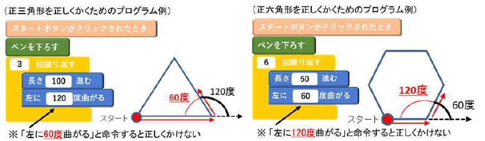

# 第３章 プログラミングに関する学習活動の分類と指導の考え方

　この章では、小学校段階におけるプログラミングに関する学習活動の分類と、分類に応じた指導の考え方を、各分類におけるプログラミングに関する学習活動の例（以下「指導例」とします。）を挙げながら解説します。

　指導例を参考として、「プログラミング的思考」の育成、プログラミングのよさ等への「気付き」やコンピュータ等を上手に活用しようとする態度の育成を図ることが望まれます。さらに、各教科等の内容を指導する中で実施する場合には、これらに加え、それぞれの教科等の目標の実現を目指した指導に取り組むことが求められます。

　プログラミング教育は、学習指導要領に例示した単元等はもちろんのこと、多様な教科・学年・単元等において取り入れることや、教育課程内において、各教科等とは別に取り入れることも可能であり、児童がプログラミングを体験しながら、コンピュータに意図した処理を行わせるために必要な論理的思考力を身に付けるための学習活動を行う必要があります。この章に示す指導例を参考として、各学校において工夫して多様な場面で適切に取り入れていくことが望まれます。

　さらに、プログラミング教育は教育課程外の様々な場面でも実施することが考えられます。図５にプログラミングに関する学習活動の分類の一例を示しました。これは、現在までに取り組まれた例を基に分類を試みたものであり、本手引では、教育課程内で実施されるＡ～Ｄ分類の指導例を示します。

　指導例を通じて、プログラミング教育の導入は、従来の各教科等の指導方法を否定するものではなく、従来、教師が取り組んできた指導をよりやりやすくしたり、より豊かにしたりすることにも貢献するものだということを理解いただきたいと思います。

　なお、より具体的な実践事例については、文部科学省、総務省、経済産業省が連携して設立した「未来の学びコンソーシアム」が運営する Web サイト「小学校を中心としたプログラミング教育ポータル」（https://miraino-manabi.jp/） において、これらの分類に沿って掲載をしています。既に本手引の指導例に関連した実践事例等について掲載しているところですので、併せて参照・活用ください。

　Ａ分類及びＢ分類は、学習指導要領に例示されているか、いないかの違いはありますが、どちらも、各教科等での学びをより確実なものとするための学習活動としてプログラミングに取り組むものです。

　これに対し、Ｃ分類は、学習指導要領に示されている各教科等とは別にプログラミングに関する学習を行うものです。C 分類では、「プログラミング的思考」の育成、プログラムのよさ等への「気付き」やコンピュータ等を上手に活用しようとする態度の育成を図ることなどをねらいとした上で、

* プログラミングの楽しさや面白さ、達成感などを味わえる題材を設定する
* 各教科等におけるプログラミングに関する学習活動の実施に先立って、プログラミング言語やプログラミングの技能の基礎について学習する
* 各教科等の学習と関連させた具体的な課題を設定する

こともでき、各学校の創意工夫を生かした取組が期待されます。ただし、この場合には、児童の負担過重とならない範囲で実施することが前提であることに留意する必要があります。

　Ｄ分類は、教育課程内で、クラブ活動など特定の児童を対象として実施されるものです。

　Ｅ分類及びＦ分類は、学校の教育課程に位置付くものではありませんが、地域や企業・団体等においてこれらの学習機会が豊富に用意され、児童の興味・関心等に応じて提供されることが期待されるところであり、各学校においても、児童の興味・関心等を踏まえ、こうした学習機会について適切に紹介するなど、相互の連携・協力を強化することが望まれます。

## Ａ 学習指導要領に例示されている単元等で実施するもの

### Ａ－①　プログラミングを通して、正多角形の意味を基に正多角形をかく場面（算数 第５学年）

> 図形を構成する要素に着目し、プログラミングを通した正多角形のかき方を発展的に考察したり、図形の性質を見いだしたりして、その性質を筋道を立てて考え説明したりする力を確実に育みます。

　ここでは、正多角形について、「辺の長さが全て等しく、角の大きさが全て等しい」という正多角形の意味を用いて作図できることを、プログラミングを通して確認するとともに、人にとっては難しくともコンピュータであれば容易にできることがあることに気付かせます。

#### （学習の位置付け）

　この学習は、正多角形の単元において、正多角形の基本的な性質や、円と関連させて正多角形を作図することができることを学習した後に展開することが想定されます。

#### （学習活動とねらい）

　学習活動としては、例えば、「辺の長さが全て等しく、角の大きさが全て等しい」という正多角形の意味を用いて正多角形を作図するといった課題を設定し、定規と分度器を用いた作図とプログラミングによる作図の双方を試みるといったことが考えられます。

　はじめに、正六角形などを定規と分度器を用いて作図することを試みさせ、手書きではわずかな長さや角度のずれが生じて、正確に作図することは難しいことを実感させます。

　次いで、プログラミングによる正方形の作図の仕方を学級全体で考え、個別又は少人数で実際にプログラミングをして正方形が正確に作図できることを確認した上で、プログラミングによる正三角形や正六角形などの作図に取り組みます。

　児童は、手書きで正方形を作図する際の「長さ□ cm の線を引く」、「（線の端から）角度が 90 度の向きを見付ける」といった動きに、どの命令が対応し、それらをどのような順序で組み合わせればよいのかを考え（プログラミング的思考）、また、繰り返しの命令を用いるとプログラムが簡潔に書けることに気付いていきます。

　そして、「正三角形をかこうとして 60 度（正六角形をかこうとして 120 度） 曲がると命令すると正しくかくことができないのはなぜか」、「なぜ正三角形のときは 120 度で、正六角形のときは 60 度でかけるのか」といった疑問をもち、他の児童と話し合い試行錯誤することによって、図形の構成要素に着目して、正多角形の角の大きさと曲がる角度との関係を見いだしていきます。また、正三角形や正六角形だけでなく、正八角形や正十二角形など、辺の数が多い正多角形も繰り返しの回数や長さ、角度を通して考えてかいていきます。

　さらに、「辺の長さが全て等しく、角の大きさが全て等しい」という正多角形の意味を用いて考察することにより、今までかいたこともない正多角形をかくことができることとともに、人が手作業でするのは難しかったり手間がかかりすぎたりすることでも、コンピュータであれば容易にできることもあるのだということに気付くことができます。

### Ａ－②　身の回りには電気の性質や働きを利用した道具があること等をプログラミングを通して学習する場面（理科 第６学年）

> プログラミングを通して、身の回りには電気の性質や働きを利用した道具があることに気付くとともに、電気の量と働きとの関係、発電や蓄電、電気の変換について、より妥当な考えをつくりだし、表現することができるようにします

　ここでは、身近にある、電気の性質や働きを利用した道具について、その働きを目的に合わせて制御したり、電気を効率よく利用したりするする工夫がなされていることを、プログラミングを通して確認します。

#### （学習の位置付け）

　この学習は、電気の利用の単元において、電気はつくりだしたり蓄えたりすることができること、光、音、熱、運動などに変換できること等について学習した後に、身の回りにはそうした電気の性質や働きを利用した道具があることについての学習に位置付けて展開することが想定されます。

#### （学習活動とねらい）

　学習活動としては、例えば、日中に光電池でコンデンサに蓄えた電気を夜間の照明に活用する際に、どのような条件で点灯させれば電気を効率よく使えるかといった問題について、児童の考えを検証するための装置と通電を制御するプログラムとを作成し実験するといったことが考えられます。具体的な実験装置としては、手回し発電機や光電池などでコンデンサに蓄えた電気を電源とし、物体との距離を計測するセンサーにより通電を制御するスイッチをつないだ、発光ダイオードの点灯回路を作成し、その上で、このスイッチの通電を制御するプログラムの作成に取り組みます。なお、児童が取り組みやすくなるよう、実際の道具よりも単純化したモデルとすることが大切です。

　児童は、人が必要とする明るさは確保しつつ、照明が点灯したままにしないなど電気を無駄なく効率よく使うためには、センサーが人を感知する距離や時間などの条件をどのように設定すればよいかなどの疑問をもち、センサーを用いた通電の制御（自分が意図する動き）はどのような手順で動作するのか、それを再現するには命令（記号）をどのように組み合わせればよいのかを考え、試行錯誤しながら（プログラミング的思考）プログラムを作成します。さらに、こうした体験を通して、人を感知するセンサーで制御された照明などが住宅や公共施設などの身近なところで活用されていることや、電気を効率的に利用したり快適に利用したりできるようプログラムが工夫されていることに気付くことができます。

### Ａ－③　「情報化の進展と生活や社会の変化」を探究課題として学習する場面（総合的な学習の時間）

> 情報技術が私たちの生活を便利にしていることをプログラミングを通して確認するとともに、この体験をよりどころとして、情報に関する探究を進めていきます。

　ここでは、情報技術が私たちの生活や社会に果たしている役割と与えている影響について調べ、また、どのように情報技術を活用していけばよいかを考えるなど、情報に関する課題の探究を進める中で、情報技術が私たちの生活を便利にしていることをプログラミングを通して確認します。

#### （学習の位置付け）

　この学習は、プログラミングの体験をよりどころとして、児童が情報に関する課題を見いだし、探究していくことができるよう、「情報」に関する探究の早い段階に位置付けることが想定されます。

#### （学習活動とねらい）

　学習活動としては、例えば、身の回りの様々な製品やシステムが、プログラムで制御されており、それらが、機械的な仕組みとは違った利点があることを、ジュースの自動販売機のプログラムの作成を通して体験的に理解する、といったことが考えられます。

　具体的には、まずカプセルトイの自動販売機とジュースの自動販売機の仕組みを比較して、コンピュータにより機械を制御することで、硬貨の種類を判別したり、残りの商品の有無や温度を管理したりなど、様々な判断を自動で行っていることに気付かせます。次いで、硬貨が投入されるとボタンが押せるようになり、ボタンを押すことでジュースの缶を排出する、といった自動販売機の動きの一部（投入された硬貨の合計額を求める、投入された金額で買える商品だけボタンを押せるようにする、ボタンが押された商品を排出するなど）を再現するプログラムを作成します。

　児童は、生活の中での経験を基に、自動販売機はどのような手順で動作しているのか、それを再現するには命令（記号）をどのように組み合わせればよいかを考え、試行錯誤します（プログラミング的思考）。こうした体験を通して、プログラムの働きを理解するとともに、機械的な仕組みでは難しいことでもコンピュータでは容易であることを実感します。

　さらに、この体験を基に自らの生活を振り返り、電気・水道・公共交通機関などのライフラインを維持管理するためにもプログラムが働いていることや、人工知能（AI）やビッグデータの活用、ロボットの活用によって、私たちの生活がより快適になり効率的になっていることにも気付きます。
　
　また、コンピュータを利用したウイルスやネット詐欺などのプログラムの悪用にも触れることで、こうした情報技術をどのように活用していけば、私たちの生活がもっと便利になり、危険なく生活できるようになるのかなどを探究する課題として設定することも考えられます。そうした探究活動を通して、「人間らしさとは何か」、「人間にしかできないこととは何か」、「人間としてどのように暮らしていけばいいのだろうか」など、自分の生き方を考え直すことも期待されます。

#### （その他考えられる学習活動の工夫）

　なお、ジュースの自動販売機をコンピュータの画面上で疑似的に再現するだけでなく、センサーを用いてスイッチが押されたことを検知したり、モーターを用いて商品を排出したりするなど、自動販売機のモデルを製作することなども考えられます。

### Ａ－④　「まちの魅力と情報技術」を探究課題として学習する場面（総合的な学習の時間）

> 身近な生活にプログラミングが活用されていることや、そのよさについて、プログラミングを通して気付くとともに、この体験をよりどころとして、情報に関する探究を進めていきます。

　ここでは、私たちの生活や社会と情報技術との関係を考えるなど、情報に関する課題の探究を進める中で、身近な生活にプログラミングが活用されていることや、そのよさについて、プログラミングを通して確認します。

#### （活動の位置付け）

　この学習は、「まち」の魅力と情報技術との関係を考えることをよりどころとして課題を見いだし、探究的な学習を進める中で、身近な生活にプログラミングが活用されていることや、そのよさについて気付かせ、更に課題の解決に必要な情報の整理や分析を行う際にプログラミングを取り入れられるように位置付けることが想定されます。

#### （学習活動とねらい）

　学習活動としては、例えば、「まち」の中で魅力的な情報発信をしているものについて考える活動の中で、身近な生活にコンピュータやプログラミングが活用されていることや、「まち」の魅力を発信することに寄与していることに気付かせ、自分が考えるまちの魅力を自分の意図する方法で発信するタッチパネル式の案内表示を作成する際にプログラミングを取り入れることが考えられます。

　具体的には、まず、「まち」の魅力や「まち」の中で魅力的に情報発信をしているものについて考え、「まちの魅力を効果的に発信しているものにはどのようなものがあるか」をテーマに意見交換を行い、「自分たちがお勧めするスポットをタッチパネル式で魅力的に発信することができないか」という課題を設定する。

　その上で、実際にタッチパネル式の案内表示を見に行き、それぞれの情報がどのような順序で表示されるようになっているのか確かめたり、タッチパネル式案内のように表示させるためのプログラミングの方法についてゲストティーチャー等からの話を聞いたりします。

　児童は集めた情報を整理しながら、ビジュアル型プログラミング言語を用いて、タッチパネル式案内表示の試作品を作成します。

　作成に当たっては、例えば、写真や動画、説明文等を自分が意図した順番やタイミング等で一連の動きとして表現するために、一つ一つの個別の動きに対応する命令を組み立てたり、一つ一つの個別の動きをつなげたりしていきます。

　また、外国人や高齢者、子供など、案内表示による情報発信の方法を対象によって変えるために、命令を分岐させることも検討していきます。

　試作品を作成した後は、作成した案内表示を発表し、他の児童から良かった点や改善点を教えてもらいながら、改善すべき点を踏まえた案内表示を作成するために、コンピュータに意図した処理をどのように改善すれば、意図した一連の動きに近づくかを試行錯誤する学習につなげていきます。

　また、作成した案内表示をモニタの方に実際に使ってもらい、感想をもらったり、利用状況についてデータを取ったりすることで、案内表示の効果について検証し、「どのような情報が利用者にとってニーズがあるのか」や、情報発信の観点から「伝えたい情報をもっと効果的に伝えていくためにはどのようなことが必要か」といった新たな課題を設定します。

　学習活動を展開するに当たっては，観光案内においてプログラミングを活用した情報収集・発信に加えて人による直接的な対応にも配慮しているなどの工夫について、商業施設や駅等の担当者にインタビューを行い、児童自身が、まちの一員として魅力ある「まち」づくりに寄与できることをまとめ、発表する学習を通して、まちの一員としての自覚をもって自分と「まち」との関わりを深めていくことができるようにすることを目指します。

### Ａ－⑤　「情報技術を生かした生産や人の手によるものづくり」を探究課題として学習する場面（総合的な学習の時間）

> プログラミングを通して、情報技術の仕組みを理解し、ものづくりのよさを知るとともに、ものづくりを支える人との関わりからものづくりの魅力や自分らしい生活についての考えを深めていきます。

　ここでは、生産と情報技術との関係を考えるなど、情報に関する課題の探究的な学習を進める中で、そのよさについて気付き、ものづくりを支える人との関わりからものづくりの魅力や自分らしい生活についての考えを深めていきます。

#### （学習の位置付け）

　この学習は、情報技術を生かした生産について考えることをよりどころとして、課題を見いだし、探究的な学習を進める中で、プログラミングの体験から、生活を支える生産活動にプログラミングが活用されていることを理解し、ものづくりのよさを知ることができるように位置付けることが想定されます。

#### （学習活動とねらい）

　学習活動としては、例えば、自動車工場にある先端の情報技術について意見交換する中で、「プログラムで命令すれば、同じ原理の車をつくることができるのではないか」ということに気付かせ、障害物を自動的に避ける自動車や車線はみ出し防止機能が付いた自動車等、自分が作ってみたいと思う自動車をプログラミングを取り入れて作成してみる学習を行うことが考えられます。

　具体的には、まず、社会科での自動車工場等のプログラミングを駆使した工場に現地学習に行ったときの様子を振り返り、産業用ロボットが活躍している様子や工場の人から受けた説明を踏まえ、自動車工場にあった先端の情報技術について意見交換する中で、「プログラムで命令できれば、同じ原理の車を作ることができるのではないか」ということに気付かせ、「自分が作ってみたい自動車」を課題として設定します。

　そして、例えば、実際の自動車に整備されている機能やセンサー等の働きや、自分たちが目指す機能を備えた自動車に必要なプログラミングの方法等、必要な情報を収集するため、地域のディーラーの方やゲストティーチャー等からの協力を得て、車に自分が意図する一連の動きをさせるためには、それらの動きは一つ一つの個別の動きをつなげたものであることや、一つ一つの個別の動きには、それらに対応する命令が必要であることを学んでいきます。

　児童は、集めた情報を整理しながら、自動車をどのように動かしていきたいかを考えた上で、そのために必要なプログラムの命令を整理し、動かしたい自動車をプログラミングします。具体的には、例えば、「衝突を予測して、回避させる」ために、「もしセンサーが障害物を感知すれば、減速し、止まる」といった命令を分岐させるなどのプログラミングを行います。

　自動車を作成した後は、他のグループに発表し、改善点を指摘してもらうことにより、改善すべき点を踏まえた自動車の動きを実現するために、コンピュータに意図した処理をどのように改善すれば、意図した一連の動きに近づくかを試行錯誤する学習にもつながります。また、実際に試行錯誤しながらプログラミングによるものづくりを体験することで、プログラミングのよさやものづくりの本質に触れる学習にもつながります。

　一方で、人の手によって作られたものが生活にどのような豊かさを与えているのかという観点から、地域の協力を得ながら、ものづくりをしている方にインタビューを行う等の学習を行い、ものづくりの魅力や苦労点をはじめ、ものづくりに携わっている方の思いをまとめ、自己の生き方についての考えを深めていくことができるようにすることを目指します。

## Ｂ　学習指導要領に例示されてはいないが、学習指導要領に示される各教科等の内容を指導する中で実施するもの

### Ｂ－①　様々なリズム・パターンを組み合わせて音楽をつくることをプログラミングを通して学習する場面（音楽	第３学年～第６学年）

> 様々なリズム・パターンの組み合わせ方について、このようにつくりたいという思いや意図をもち、様々なリズム・パターンの面白さに気付きながら、プログラミングによって試行錯誤をすることを通して、まとまりのある音楽をつくります。

　ここでは、様々なリズム・パターンを組み合わせた、まとまりのある音楽づくりを、プログラミングによって行います。

#### （学習の位置付け）

　音楽づくりの題材において、プログラミングによってまとまりのある音楽をつくった後、つくった音楽を実際に自分たちで表現し、それぞれの表現のよさを認め合う学習が想定されます。

#### （学習活動とねらい）

　様々なリズム・パターンを組み合わせて、まとまりのある音楽をつくるという課題を設定し、プログラミング言語又は創作用ソフト等を用いて音楽づくりをすることが考えられます。

　児童は、教師があらかじめ用意しておいた、例えば、「ドンドン」、「ドンドコ」、「ドドンコ」といったリズム・パターンを実際に表現し、即興的に選択したり組み合わせたりする活動を楽しんだ後に、まとまりを意識した音楽をつくることに取り組みます。その際、このような音楽を、このようにしてつくりたいという自分の考えをもち、音楽の仕組みを意識しながら、プログラミング言語又は創作用ソフト等を用いて様々なリズム・パターンの組み合わせ方を試し、更に工夫を重ねて試行錯誤し（プログラミング的思考）、音楽をつくっていきます。

　この過程において、つくった音楽の構造を視角的に捉え、つくった音楽を再生しモニタリングしながら、リズム・パターンの組合せの面白さに気付くとともに、音楽の仕組みを用いてつくる技能を身に付け、音楽表現を高めていきます。器楽の技能や読譜などの力に大きく左右されずに活動できるため、無理なく音楽づくりの学習に取り組むことが期待されます。

　その後、つくった音楽を実際に演奏して互いに聴き合い、それぞれの表現のよさを認め合う学習を展開することも大切です。

#### （その他考えられる学習活動の工夫）

　これはリズム・パターンを組み合わせて音楽をつくる活動ですが、音の長さや高さ、強弱、速度などをプログラミングしながら、表情豊かな旋律をつくる活動をすることも考えられます。

### Ｂ－②　都道府県の特徴を組み合わせて４７都道府県を見付けるプログラムの活用を通して、その名称と位置を学習する場面（社会 第４学年）

> 都道府県の地理的環境や自然条件、面積、人口や特産物などの特色を組み合わせて４７都道府県を見付けるプログラムの活用を通して、４７都道府県の名称と位置を確かめ、その確実な習得を図ります。

　ここでは、コンピュータのプログラムと地図帳や白地図を同時に活用しながら、都道府県の特徴を組み合わせて都道府県を特定する活動を通して、４７都道府県の名称と位置を、その特徴とともに理解することができるようにします。

#### （学習の位置付け）

　この学習は、地図帳などを活用して、地図上で各都道府県の名称や位置を調べて確認したり、白地図上に書き記したりする活動を通して、我が国が４７都道府県で構成されていることや４７都道府県の名称と位置を理解すること等についての学習に位置付けて展開することが想定されます。

#### （学習活動とねらい）

　この学習では、４７都道府県の特徴が記されたブロックを組み合わせることにより、組み合わせたブロック（特徴）に合致した都道府県の名称と位置を示すプログラムを使用します。

　学習活動としては、例えば、地図帳を活用して各都道府県の特徴を探し、プログラム上で３つ以上のブロック（特徴）を組み合わせて、示された都道府県の名称と位置を白地図に書き込むといった活動が考えられます。

　その際、特徴に合致する都道府県が複数ある場合は、示される都道府県が１つに絞られるように、特徴の組合せという条件を変更する必要があります。このため、児童は、地図帳を活用して特徴を探し、試行錯誤しながら様々な特徴を組み合せ（条件を設定し）、都道府県が１つに特定される特徴の組合せを探します。こうした活動により、児童は、都道府県の特徴とともに、名称と位置を理解していきます。

　足りない条件（特徴）を地図帳を活用して探すことや、見付けた都道府県は白地図に色を塗ること、何度も繰り返し取り組むことで、単に地図上で理解することよりも思考を伴った学習活動になることが期待できます。

### Ｂ－③　自動炊飯器に組み込まれているプログラムを考える活動を通して、炊飯について学習する場面（家庭 第６学年）

> ご飯をおいしく炊くためのプログラミング体験を行うことにより、炊飯の一連の手順について理解を深めるとともに、身近な生活にコンピュータ（プログラム）が活用されていることにも気付くことができるようにします。

　ここでは、炊飯に関する一連の手順をプログラミングする体験を通して、自動炊飯器に組み込まれているプログラムを考え、炊飯について理解させるとともに、身近な生活には、家電製品などにコンピュータ（プログラム）が活用されていることにも気付かせます。

#### （学習の位置付け）

　この学習は、第５学年の米飯とみそ汁の調理で、鍋での炊飯を経験していることを生かして、第６学年で家族と食べる朝食（米飯とみそ汁を中心とした１食分）の献立を考え、おいしく食べるために調理計画を工夫する学習に位置付けて展開することが想定されます。なお、この学習では、米飯と組み合わせた１食分を一人で調理することから、米飯の調理については、自動炊飯器による炊飯とし、調理計画を考えることとしています。

#### （学習活動とねらい）

　学習活動としては、例えば、炊飯に関する一連の手順についてプログラミング体験を行い、ご飯がおいしく炊けたり炊けなかったりする原因について考え、話し合うなどの活動が考えられます。

　具体的には、まず、各自が立てた調理計画を確認します。その際、自動炊飯器の中では、どのようなことが行われているのか、鍋での炊飯の経験をもとに予想します。

　次に、水加減や浸水時間、加熱の仕方、蒸らしなどの炊飯に関する一連の手順について、コンピュータ上で並べ替えと条件設定（プログラミング）を行います。その際、水加減や加熱の仕方（火加減）等の条件を変えて、２回程度行い、ご飯が柔らかくなったり硬くなったりする原因について考えます。そして、炊飯について分かったことや気付いたことをグループや学級内で発表し合うとともに、このプログラミング体験をもとに、各自の調理計画（主菜・副菜・みそ汁）についても調理の手順や時間配分を工夫することを確認します。

　最後に、自動炊飯器の他にも身近な生活の中にコンピュータ（プログラム） が活用されているものはないか、発表し合います。

　この学習では、第５学年での鍋での炊飯の経験を生かし、一連の炊飯の手順が、自動炊飯器にどのようにプログラムされているのかに関心をもたせるようにすることが重要です。これにより、このプログラミング体験は、自動炊飯器の様々な機能がどのように作られているか、身近な家電製品がどのような仕組みになっているのかなどにも関心をもつことにもつながります。また、調理の手順を考え、調理計画を立てることにも生かすことが期待できます。

### Ｂ－④　課題について探究して分かったことなどを発表（プレゼンテーション）する学習場面（総合的な学習の時間）

　ここでは、課題について探究して分かったことや考えたことなどを、プログラミングによって、より分かりやすく効果的に発表（プレゼンテーション） する資料を作成します。

#### （学習の位置付け）

　この学習は、様々な課題を設定して行われる探究活動のまとめの段階に位置付けて実施することが考えられます。

#### （学習活動とねらい）

　学習活動としては、例えば、「街づくり」を課題に設定して探究活動を行い、分かったことや考えたことなどを発表するための資料を作成する際、地図上のある地点にマウスポインタを移動させると、その場所の魅力や、その場所に寄せる地域の人々の思い、その場所に関わる街づくりの課題や取組などを、文字、音声、アニメーションなどで紹介するようプログラミングすることなどが想定されます。

　児童は、どのような内容を紹介するかだけでなく、どのような方法で紹介するか、更に「発表をスムーズに行うために、マウスではなくキーボードで操作するにはどうすればよいか」といったことを考え、試行錯誤しながら発表資料を作成します。その過程で、自分の意図する資料を作成したり発表したりするための手順（組合せ）などを考えていきます（プログラミング的思考）。

　なお、こうした学習活動は、総合的な学習の時間のみならず、他の教科等でも取り入れることが考えられます。

## Ｃ　教育課程内で各教科等とは別に実施するもの

　プログラミングの体験は、各教科等の内容を指導する中で実施するほか、各教科等とは別に（何らかの教科等に位置付けることなく）、かつ教育課程内で、実施することも考えられます。この場合は、児童の負担過重にならないことを前提として、各学校の裁量で行うこととなります。

　Ｃ分類は、Ａ分類及びＢ分類とは異なり、各教科等に位置付けているものではないことから、各教科等の学びを確実にするということをねらいにする必要はなく、第２章（１）（p.11)の①「プログラミング的思考」を育むこと、②プログラムの働きやよさ、情報社会がコンピュータ等の情報技術によって支えられていることなどに気付くことができるようにするとともに、コンピュータ等を上手に活用して身近な問題を解決したり、よりよい社会を築いたりしようとする態度を育むことを目標とします。

　これら①・②を育むことをねらいとした上で、創意工夫により様々な取組を実施することが考えられますが、例えば、

１）プログラミングの楽しさや面白さ、達成感などを味わえる題材などでプログラミングを体験する取組

２）各教科等におけるプログラミングに関する学習活動の実施に先立って、プログラミング言語やプログラミングの技能の基礎についての学習を実施する取組

３）各教科等の学習と関連させた具体的な課題を設定する取組等を実施することができます。

　３）については、各教科等の学習と関連させた具体的な課題を設定して実施することで児童が取り組みやすくなることが考えられます。

　こうしたプログラミングの体験は、各学校の創意工夫による取組であるため、どのような力を育みたいのかを明らかにした上で授業内容を検討し、よりよいものにしていくことが望まれます。また、前述の①と②の育成を目標としながら、発達の段階や児童の実態に適した内容とする、少ない時間でも効果的に無理なく体験できる内容とするなどというように指導方法を工夫していくことが望まれます。

### Ｃ－①　プログラミングの楽しさや面白さ、達成感などを味わえる題材などでプログラミングを体験する取組

　例えば、学校の裁量で時間を確保し、簡単なプログラムを作成することが考えられます。

　具体的には、ビジュアル型プログラミング言語を用いて、画面上を自動的に動くキャラクターⅠに捕まらないよう、自分で別のキャラクターⅡを動かすことができるプログラムを制作するという題材を設定し、実際に、キャラクターⅠが自動的に画面上を動くプログラム、キャラクターⅡを自分で操作できるようにするプログラム、キャラクターⅠとⅡが触れたときに動作が停止するプログラムなどを作成することが考えられます。

　また、ある程度児童がプログラミングを体験した後に、ビジュアル型プログラミング言語を用いて、キャラクターを動かして、ランダムに降ってくる星を獲得するプログラムを制作するという題材を設定し、実際にキャラクターを動かすプログラム、星が降ってくるプログラムや、獲得した星の数を表示するプログラムなどを作成することが考えられます。児童の実態に応じて、キャラクターにアニメーションを加えたり、児童に自由に表現させることも考えられます。

　こうしたプログラミングの体験を通して、コンピュータの画面上のものがプログラムで動いていることに気付いたり、プログラミング的思考を育むとともに、プログラミングの楽しさや面白さ、ものごとを成し遂げたという達成感を味わうことにつながることが期待されます。

### Ｃ－②　各教科等におけるプログラミングに関する学習活動の実施に先立って、プログラミング言語やプログラミングの技能の基礎についての学習を実施する例

　例えば、各教科等におけるプログラミングに関する学習活動の実施に先立って、学校の裁量で時間を確保し、プログラミング言語やプログラミングに関する基礎的な知識や技能の習得などを目的として、プログラミングを体験することも考えられます。

　後に実施する単元等で使用する予定であるプログラミング言語やソフトウェアの操作を、１～数単位時間程度でもあらかじめ経験しておくことにより、各教科等におけるプログラミングに関する学習活動に、児童は戸惑うことなく取り組むことができ、授業が円滑に進められることが期待されます。

　こうしたプログラミングの体験そのものは直ちに各教科等の学習として位置付くものではありませんが、キーボードによる文字入力やファイル操作等の情報機器の基本的な操作技能と同様に、後の学習活動を円滑に進めるための学習活動として、学校の判断により計画的に取り組むことが考えられます。

### Ｃ－③－１　各教科等の学習を基に課題を設定し、プログラミングを通して課題の解決に取り組む学習を展開する例

　例えば、学校の裁量で時間を確保し、社会科の我が国の工業生産（第５学年）における優れた製品を生産するための様々な工夫や努力の学習と関連付けて、自動追突防止装置のついた自動車のモデルの製作と追突を回避するためのプログラムの作成を行うことなどが考えられます。

　具体的には、距離を計測するセンサーと車輪を駆動するモーターを組み込んだ、自動車の簡単なモデルを製作し、それを制御するプログラムを作成します。地域の産業の特色に応じて、自動車以外の工業生産を取り上げたり、農業生産や運輸などの学習と関連付けて同様の活動を展開したりすることも考えられます。

　こうしたプログラミングの体験を通して児童が実感を伴って学ぶことで、工業生産などに関わる技術の開発や研究などの理解につながることが期待されます。

　なお、指導例Ａ－⑤（p.30）と本指導例は、前者は総合的な学習の時間の活動として、探究的な学習のプロセスに位置付けてプログラミングを体験するものとしている点で異なります。仮に本指導例を総合的な学習の時間において実施する場合においては、総合的な学習の時間における活動として、探究的な学習のプロセスの中に適切に位置付けて実施する必要があります。

### Ｃ－③－２　各教科等の学習を基に、プログラミングを通して表現したいものを表現する学習を展開する例

　例えば、国語科において物語を読む学習をした後、学校の裁量で時間を確保し、物語の中から好きな場面を選び、その場面のアニメーションを作成することなどが考えられます。

　具体的には、登場人物と背景の絵をかきその絵をカメラやスキャナで取り込むなどして、プログラミングにより登場人物が動いたり、話したりするようにします。そして、互いの作品を見せ合い、その場面での登場人物の気持ちや情景はどのようであると考えたのか、登場人物の気持ちや情景を表現するためにどのような工夫をしたのかなどについて話し合ったりすることなどが考えられます。

## Ｄ　クラブ活動など、特定の児童を対象として、教育課程内で実施するもの

　クラブ活動は、異年齢の児童同士で協力し、共通の興味・関心を追求する集団活動であり、学校の創意工夫により、コンピュータクラブ、プログラミングクラブなどを設けて、コンピュータやプログラミングに興味・関心を有する児童が協力してプログラムを作成するなどの活動を実施することが考えられます。

　活動の内容としては、例えば、①「オリジナルアニメーションをつくろう」といった動的なコンテンツの作成を行うものや、②「家で使える便利な機械を考えよう」といったセンサーとアクチュエータ（モーターなどの駆動装置）を活用した機械のモデルとそれを制御するプログラムの作成を行うものなどが考えられます。

　①については、キャラクター等の動きを制御することなどが考えられますが、慣れてくると、画像や音声についても自分で作成したいという意欲をもつ児童も出てくることが想定されます。②についても、各教科等の学習の中でつくるものよりも更に自由な発想で、様々な機械のモデルとそれを制御するプログラムを作成したいという意欲をもつことが想定されます。

　使用する教材やプログラミング言語については、児童の発達の段階やプログラミングの経験、作成しようとするものなどに応じて適切なものを選択することとし、場合によっては、テキスト型の言語を用いることも考えられるでしょう。その一方で、プログラミングに関する知識、技能や経験の少ない児童には、スモールステップの課題から取り組ませ、徐々に大作に取り組めるようにすることも考えられます。

　活動の展開については、漫然とプログラムの作成を続けるのではなく、発表会の時間を設けるなどして、それまでに完成させるといった、一定の目標をもたせるとよいでしょう。その際、発表会には保護者や地域の方にも来ていただくといったことを企画することも考えられます。さらに、様々な企業・団体等が実施している小学生が参加できるプログラミング・コンテストなどに挑戦させることも考えられます。

　なお、こうしたクラブ活動や、教育課程外のプログラミングに関する学習機会（図５（p.22）の分類におけるＥ及びＦ）においてプログラミングに関する知識や技能を習得した児童に、教育課程内でプログラミングを実施する場面で、コンピュータの操作やプログラミングを苦手とする児童のサポート等の役割をもたせることなども有効と考えられます。